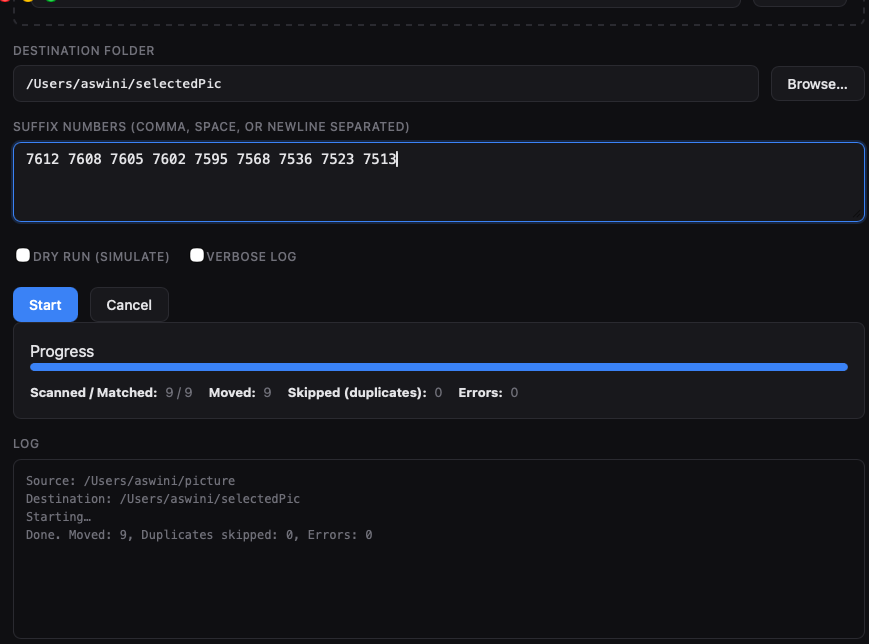

# FrameMover

A desktop app that finds image files whose **filename ends with** the numbers you specify (e.g. `IMG_7612.JPG`, `photo-7608.heic`) and **moves** them from a source folder to a destination folder. It keeps folder structure, skips duplicates by content, and handles name clashes safely.

- **Tech:** Tauri v2, Rust backend, Vite + React (TypeScript) frontend  
- **Platforms:** macOS (primary), Windows and Linux  
- **Privacy:** Only accesses folders you choose (no Full Disk Access)

---

## What it looks like

The app lets you pick a **source** and **destination** folder, enter suffix numbers (comma, space, or newline separated), and run. Progress and a log show what’s happening.

| Completed run | With verbose log |
|--------------|------------------|
|  |  |

You’ll see:

- **Source / Destination** – chosen folders  
- **Suffix numbers** – e.g. `7612 7608 7605 7602 7595 7568 7536 7523 7513`  
- **Dry run** – simulate only (no files moved)  
- **Verbose log** – extra detail in the log  
- **Progress** – bar and counts (scanned, matched, moved, skipped, errors)  
- **Log** – summary and optional verbose output  

---

## Features

- **Move** (not copy) matching image files
- **Deduplication** – skips files whose content already exists at the destination (SHA-256)
- **Preserve structure** – e.g. `Source/A/B/IMG_7612.JPG` → `Dest/A/B/IMG_7612.JPG`
- **Progress UI** – progress bar and counts
- **Dry run** and **Verbose log** toggles
- **Cancel** – stop the run cleanly
- **CLI mode** – use from the terminal with `--source`, `--dest`, `--suffixes`
- **Drag-and-drop** – drop a folder on the source area when supported

---

## Prerequisites

- [Node.js](https://nodejs.org/) (for npm/pnpm)
- [Rust](https://rustup.rs/)
- [Tauri prerequisites](https://v2.tauri.app/start/prerequisites/) for your OS

---

## Quick start

### Install and run (GUI)

```bash
git clone <your-repo-url>
cd FrameMover
npm install
npm run tauri dev
```

Or with pnpm:

```bash
pnpm install
pnpm run tauri dev
```

### Build a release app

```bash
npm run tauri build
```

Outputs are under `src-tauri/target/release/` (e.g. **FrameMover.app** on macOS).

---

## How to use the GUI

1. **Source folder** – Click “Browse…” and choose the folder that contains your images.
2. **Destination folder** – Choose where you want the matching files moved.
3. **Suffix numbers** – Enter the numbers that appear at the end of the filenames you want (e.g. `7612 7608 7605`). You can use commas, spaces, or newlines.
4. **Dry run** – Check this to see what would be moved without moving anything.
5. **Verbose log** – Check this for more detail in the log.
6. Click **Start**. Use **Cancel** to stop.

Matching rules:

- A file matches if the **filename (without extension)** ends with one of your numbers (e.g. `IMG_7612` → `7612`).
- Supported image extensions: jpg, jpeg, png, heic, gif, tiff, webp (case-insensitive).

---

## CLI mode

Run the built binary with arguments for headless use (same engine as the GUI).

```bash
./photo-suffix-mover --source "/path/to/source" --dest "/path/to/dest" --suffixes "7612,7608,7605"
```

Optional flags:

- `--dry-run` – simulate only; no files are moved.
- `--verbose` / `-v` – extra log output.

Example with space-separated suffixes:

```bash
./photo-suffix-mover --source "/Users/me/Photos" --dest "/Users/me/Selected" \
  --suffixes "7612 7608 7605 7602 7595 7568 7536 7523 7513"
```

From the macOS app bundle:

```bash
./FrameMover.app/Contents/MacOS/photo-suffix-mover \
  --source "/Users/me/Photos" --dest "/Users/me/Selected" \
  --suffixes "7612,7608,7605" --dry-run
```

Exit code: **0** on success, **non-zero** if any errors occurred.

---

## Behaviour details

- **Suffix input:** Comma-, space-, or newline-separated numbers.
- **Duplicates:** By SHA-256 of file contents; if the same content already exists under the destination, the file is skipped.
- **Name collision:** If the destination path exists with different content, the file is moved with a unique name (`-1`, `-2`, … before the extension).
- **Move:** Uses atomic rename on the same volume; copy + delete across different volumes.

---

## Project layout

| Path | Description |
|------|-------------|
| `package.json`, `vite.config.ts`, `index.html` | Frontend tooling and entry |
| `src/App.tsx`, `src/App.css` | React UI and styles |
| `src-tauri/Cargo.toml` | Rust dependencies |
| `src-tauri/tauri.conf.json` | Tauri app and build config |
| `src-tauri/src/main.rs` | CLI (clap) + Tauri entry |
| `src-tauri/src/lib.rs` | Commands and app setup |
| `src-tauri/src/engine/` | Core scan/move engine |
| `docs/screenshot-*.png` | README screenshots |

---

## License

MIT.
